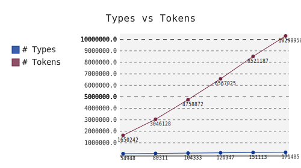

Don't Settle for a List of Strings
==================================

    *"Other tokenizers return lists of strings, which is downright
    barbaric."* --- me

spaCy splits text into a list of lexical types, which come with a variety of
features pre-computed. Its design **makes the right thing easy**: your NLP applications
will probably be more efficient and accurate if you write them using spaCy.

Let's say you're writing an entity tagger for English. Case distinctions are an
important feature here: you need to know whether the word you're tagging is
upper-cased, lower-cased, title-cased, non-alphabetic, etc.
The right thing is to call the string.isupper(), string.islower(), string.isalpha()
etc functions once for every *type* in your vocabulary, instead
of once for every *token* in the text you're tagging.
Other tokenizers give you **a list of strings, which makes the wrong thing
easy.**

And the right thing isn't just a little bit better: it's *exponentially* better,
because of `Zipf's law <http://en.wikipedia.org/wiki/Zipf's_law>`_:

   Vocabulary size is expected to grow exponentially slower than the number
   of tokens in a sample of natural language. spaCy takes advantage of this by
   **computing features over types not tokens**.

Zipf's Law also makes distributional information a really powerful source of
type-based features. It's really handy to know where a word falls in the language's
frequency distribution, especially compared to variants of the word.  For instance,
we might be processing a Twitter comment that contains the string "nasa". We have
little hope of recognising this as an entity except by noting that the string "NASA"
is much more common, and that both strings are quite rare.

Each spaCy Lexeme comes with a rich, curated set of orthographic and
distributional features.  The exact set of features is language-specific,
to take into account different orthographic conventions and morphological
complexity. It's also easy to define your own features.

Finally, spaCy also takes care to get the details right.  Indices into the original
text are always easy to calculate, so it's easy to, say, mark entities with in-line
mark-up. You'll also receive tokens for newlines, tabs and other non-space whitespace,
making it easy to do paragraph and sentence recognition.  And, of course, we deal
smartly with all the random unicode whitespace and punctuation characters you might
not have thought of.

Benchmarks
----------

+--------+-------+--------------+--------------+
| System | Time	 | Words/second | Speed Factor |
+--------+-------+--------------+--------------+
| NLTK	 | 6m4s  | 89,000       | 1.00         |
+--------+-------+--------------+--------------+
| spaCy	 |       |           	|              |
+--------+-------+--------------+--------------+

The comparison refers to 30 million words from the English Gigaword, on
a Maxbook Air.  For context, calling string.split() on the data completes in
about 5s.

Pros and Cons
-------------

Pros:

- Stuff

Cons:

- It's new (released September 2014)
- Higher memory usage (up to 1gb)
- More complicated
- Tokenization rules expressed in code, not as data
